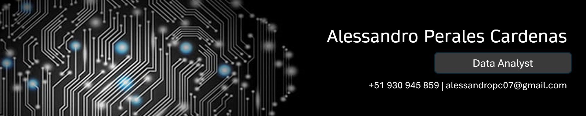

### **Hi, everyone!👋**

### About Me
- 🏪 I've been working in the consumer goods industry for about 5 years, specifically in finance, accounts payable, and vendor payments.
- 🗒️ Currently, I'm in the Accounts Payable department. However, my focus is solely on Business Intelligence and Data Analytics tasks 😅
- 💻 I have experience in BI, Data Visualization, Data Analysis, Dashboard Design and Development.
- 📈 Additionally, I've worked on some FTE Optimization projects using low-code platforms (Power Apps and Automate) and Python scripts (SAP Integrations).
- 📊 I'm focusing on developing my skills in Data Science and Machine Learning.
- 👔 I studied Business Administration, but I became more interested in data analysis and related fields during my studies.

### Skills
- Power BI 
- Python
- Visual Basic
- SQL
- Basic Data Science and Machine Learning
- Power Platform (Power Apps and Power Automate)
- SAP R3/S4H FI

I'm going to be uploading some of my projects here. I hope someone finds it useful! 🙋‍♂️

### Contact
- Here's my [LinkedIn](https://www.linkedin.com/in/alessandro-perales-cardenas/)
- And my email: alessandropc07@gmail.com
